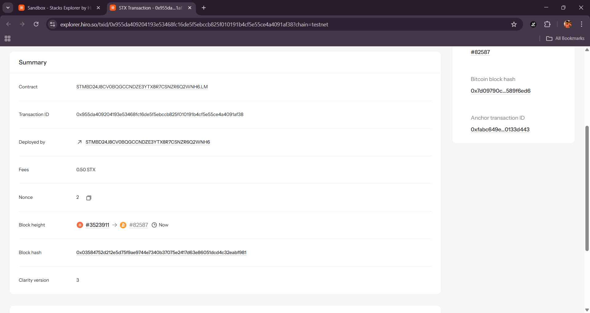

# Liquidity Mining

## Project Description

A Clarity smart contract that implements bootstrap liquidity incentives with emission schedules. The contract allows users to stake STX as liquidity and earn reward tokens based on a configurable emission rate. Users are rewarded proportionally to their liquidity contribution and the time they maintain their stake in the protocol.

The system features two core functions:
- **Stake Liquidity**: Users can deposit STX to participate in liquidity mining and start earning rewards
- **Claim Rewards**: Users can claim accumulated reward tokens based on their liquidity contribution and staking duration

## Project Vision

Our vision is to create a robust liquidity mining infrastructure that incentivizes early adopters and liquidity providers in the Stacks ecosystem. By implementing fair and transparent emission schedules, we aim to bootstrap protocol liquidity while rewarding community participation. The project serves as a foundation for DeFi protocols looking to attract and retain liquidity through token incentives.

## Future Scope

### Phase 1 - Enhanced Functionality
- **Unstaking Mechanism**: Implement functionality to withdraw staked liquidity
- **Multiple Token Support**: Extend support beyond STX to other SIP-010 tokens
- **Flexible Emission Curves**: Implement different emission models (linear, exponential decay, etc.)

### Phase 2 - Advanced Features
- **Liquidity Pool Integration**: Connect with AMM protocols for actual liquidity provision
- **Multi-tier Rewards**: Implement bonus multipliers for long-term stakers
- **Governance Integration**: Allow token holders to vote on emission parameters

### Phase 3 - Ecosystem Integration
- **Cross-protocol Compatibility**: Enable liquidity mining across multiple DeFi protocols
- **Yield Farming Strategies**: Implement auto-compounding and strategy optimization
- **Analytics Dashboard**: Provide detailed metrics and performance tracking

### Phase 4 - Scalability & Optimization
- **Gas Optimization**: Reduce transaction costs through contract efficiency improvements
- **Batch Operations**: Enable batch claiming and staking for multiple users
- **Oracle Integration**: Implement price feeds for dynamic reward calculations

## Contract Address Details
STMBD24J8CV0BQGCCNDZE3YTX8R7CSNZR6Q2WNH6.LM
### Screenshot:
